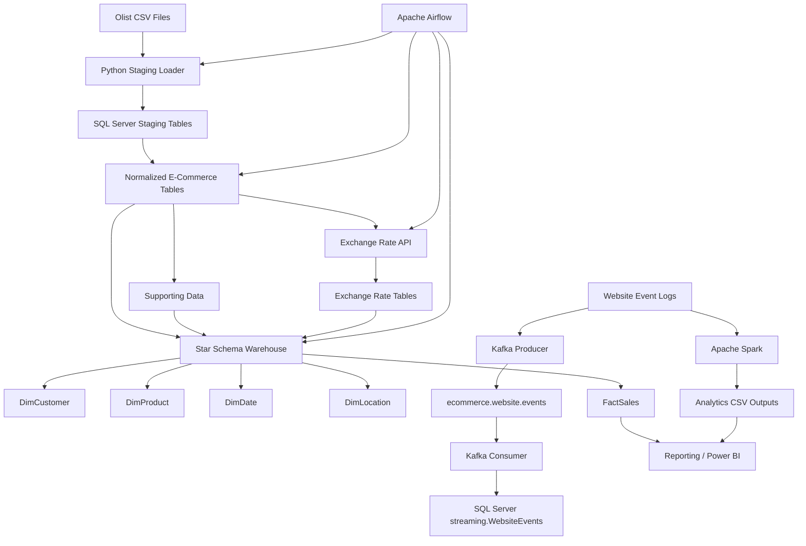

# End-to-End E-Commerce Data Engineering Pipeline

## Project Overview

This project implements an end-to-end e-commerce data engineering pipeline using the Olist Brazilian E-Commerce dataset.

The solution includes:

- CSV ingestion into SQL Server staging tables
- Data cleaning and normalization
- Supporting dataset loads
- Historical BRL-to-USD exchange-rate API integration
- Star-schema data warehouse
- Apache Airflow orchestration
- Apache Spark website-event analytics
- Apache Kafka streaming
- SQL Server streaming storage
- ETL audit logging
- Data-quality validation

---

## Architecture



---

## Technology Stack

- Python 3
- SQL Server 2019 Developer Edition
- PyODBC
- Pandas
- Apache Airflow 3.3.0
- Docker
- Docker Compose
- Apache Spark / PySpark
- Apache Kafka
- REST API Integration
- Power BI-friendly CSV outputs

---

## Data Sources

### Olist E-Commerce Dataset

Main source files:

- `olist_customers_dataset.csv`
- `olist_products_dataset.csv`
- `olist_orders_dataset.csv`
- `olist_order_items_dataset.csv`
- `olist_order_payments_dataset.csv`
- `olist_order_reviews_dataset.csv`
- `olist_sellers_dataset.csv`
- `olist_geolocation_dataset.csv`
- `product_category_name_translation.csv`

### Verified Core Row Counts

| Dataset | Rows |
|---|---:|
| Customers | 99,441 |
| Products | 32,951 |
| Orders | 99,441 |
| Order Items | 112,650 |

---

## Exchange Rate API

Historical BRL-to-USD exchange-rate data is extracted using a REST API.

Flow:

```text
ecommerce.Orders
      ↓
Determine Order Date Range
      ↓
Exchange Rate API
      ↓
staging.ExchangeRates
      ↓
ecommerce.ExchangeRates
      ↓
warehouse.FactSales
```

Exchange rates are used to calculate USD values in the warehouse.

---

## SQL Server Architecture

The SQL Server database uses multiple schemas.

### Staging Layer

```text
staging.Customers
staging.Products
staging.Orders
staging.OrderItems
staging.Payments
staging.Sellers
staging.Reviews
staging.CategoryTranslation
staging.ExchangeRates
```

### Normalized Layer

```text
ecommerce.Customers
ecommerce.Products
ecommerce.Orders
ecommerce.OrderItems
ecommerce.ProductCategories
ecommerce.Sellers
ecommerce.Payments
ecommerce.Reviews
ecommerce.ExchangeRates
```

### Data Warehouse

```text
warehouse.DimCustomer
warehouse.DimProduct
warehouse.DimDate
warehouse.DimLocation
warehouse.FactSales
```

### Audit Layer

```text
audit.ETLRun
audit.DataQualityResults
```

### Streaming Layer

```text
streaming.WebsiteEvents
```

---

## Stored Procedures

Main stored procedures:

```text
ecommerce.usp_LoadNormalizedData
ecommerce.usp_LoadSupportingData
ecommerce.usp_LoadExchangeRates
warehouse.usp_LoadWarehouse
warehouse.usp_ApplyExchangeRates
warehouse.usp_GetSalesReport
```

---

## Airflow Orchestration

The main Airflow DAG is:

```text
ecommerce_pipeline
```

Pipeline flow:

```text
check_sql_server
        ↓
load_staging
        ↓
load_normalized
        ↓
load_supporting_data
        ↓
extract_exchange_rates
        ↓
load_exchange_rates
        ↓
load_warehouse
        ↓
apply_exchange_rates
        ↓
validate_pipeline
```

The DAG uses:

```python
max_active_runs=1
```

This prevents multiple copies of the same pipeline from running at the same time.

The complete Airflow workflow has been successfully executed.

---

## Spark Website Analytics

Synthetic website-event logs were generated for:

```text
5,000 sessions
```

Spark processed:

```text
Total Events   : 14,512
Valid Events   : 14,512
Invalid Events : 0
```

### Funnel Metrics

| Metric | Value |
|---|---:|
| Total Sessions | 5,000 |
| Product View Sessions | 5,000 |
| Add to Cart Sessions | 2,245 |
| Checkout Sessions | 1,346 |
| Purchase Sessions | 921 |
| Conversion Rate | 18.42% |
| Cart Abandonment Rate | 58.98% |

### Device Metrics

| Device | Events | Sessions |
|---|---:|---:|
| Mobile | 4,937 | 1,690 |
| Tablet | 4,903 | 1,681 |
| Desktop | 4,672 | 1,629 |

Spark performs the transformations and aggregated analytics results are saved as CSV files.

Example output location:

```text
data/processed/website_analytics/
```

---

## Kafka Streaming

Kafka topic:

```text
ecommerce.website.events
```

Verified configuration:

```text
Partition Count     : 3
Replication Factor  : 1
ISR                 : Available
```

Streaming architecture:

```text
Website Events
      ↓
Kafka Producer
      ↓
ecommerce.website.events
      ↓
Kafka Consumer
      ↓
SQL Server
      ↓
streaming.WebsiteEvents
```

Kafka consumer successfully processed:

```text
14,512 events
```

---

## Data Quality Validation

The pipeline includes checks for:

- Null customer IDs
- Null product IDs
- Invalid customer references
- Invalid order references
- Invalid product references
- Invalid prices
- Empty tables
- ETL execution status
- Streaming duplicates

Results are stored in:

```text
audit.ETLRun
audit.DataQualityResults
```

---

## Reporting Views

The warehouse contains reporting views:

```text
warehouse.vw_SalesDetail
warehouse.vw_MonthlySales
warehouse.vw_ProductPerformance
warehouse.vw_CustomerSummary
```

---

## Project Structure

```text
ecommerce-data-engineering-pipeline/
│
├── airflow/
│   ├── dags/
│   │   └── ecommerce_pipeline_dag.py
│   ├── Dockerfile
│   ├── docker-compose.yaml
│   └── docker-compose.override.yaml
│
├── data/
│   ├── raw/
│   │   ├── olist/
│   │   ├── website_logs/
│   │   └── exchange_rates/
│   ├── processed/
│   └── rejected/
│
├── logs/
│
├── spark/
│   └── process_website_logs.py
│
├── sql/
│   ├── 01_database_setup.sql
│   ├── 02_create_staging_tables.sql
│   ├── 03_create_normalized_tables.sql
│   ├── 04_create_audit_tables.sql
│   ├── 05_load_normalized_data.sql
│   ├── 06_create_warehouse_tables.sql
│   ├── 07_load_warehouse.sql
│   ├── 08_create_reporting_views.sql
│   ├── 09_analytical_queries.sql
│   ├── 10_reporting_procedure.sql
│   ├── 11_create_supporting_staging_tables.sql
│   ├── 12_create_supporting_normalized_tables.sql
│   ├── 13_load_supporting_normalized_data.sql
│   ├── 14_create_exchange_rate_tables.sql
│   ├── 15_load_exchange_rates.sql
│   ├── 16_apply_exchange_rates.sql
│   └── 17_create_streaming_tables.sql
│
├── src/
│   ├── db_connection.py
│   ├── load_staging.py
│   ├── load_supporting_staging.py
│   ├── extract_exchange_rates.py
│   ├── generate_website_logs.py
│   ├── kafka_producer.py
│   ├── kafka_consumer.py
│   ├── run_pipeline.py
│   ├── data_profiling.py
│   └── test_connection.py
│
├── requirements.txt
├── .gitignore
└── README.md
```

---

## How to Run

### 1. Activate Virtual Environment

```powershell
Set-ExecutionPolicy -Scope Process -ExecutionPolicy Bypass
.\venv\Scripts\Activate.ps1
```

---

### 2. Start Airflow

```powershell
cd .\airflow
docker compose up -d
```

Open Airflow:

```text
http://localhost:8080
```

Run:

```text
ecommerce_pipeline
```

---

### 3. Run Spark Analytics

From project root:

```powershell
python .\spark\process_website_logs.py
```

---

### 4. Check Kafka Container

```powershell
docker ps --filter "name=ecommerce-kafka"
```

Describe the Kafka topic:

```powershell
docker exec ecommerce-kafka /opt/kafka/bin/kafka-topics.sh --bootstrap-server localhost:9092 --describe --topic ecommerce.website.events
```

Run producer:

```powershell
python .\src\kafka_producer.py
```

Run consumer:

```powershell
python .\src\kafka_consumer.py
```

---

## SQL Validation

### Normalized Data

```sql
SELECT COUNT(*) AS Customers
FROM ecommerce.Customers;

SELECT COUNT(*) AS Products
FROM ecommerce.Products;

SELECT COUNT(*) AS Orders
FROM ecommerce.Orders;

SELECT COUNT(*) AS OrderItems
FROM ecommerce.OrderItems;
```

Expected:

```text
Customers  = 99,441
Products   = 32,951
Orders     = 99,441
OrderItems = 112,650
```

---

### Warehouse Validation

```sql
SELECT 'DimCustomer' AS TableName, COUNT_BIG(*) AS RowCount
FROM warehouse.DimCustomer

UNION ALL

SELECT 'DimProduct', COUNT_BIG(*)
FROM warehouse.DimProduct

UNION ALL

SELECT 'DimDate', COUNT_BIG(*)
FROM warehouse.DimDate

UNION ALL

SELECT 'DimLocation', COUNT_BIG(*)
FROM warehouse.DimLocation

UNION ALL

SELECT 'FactSales', COUNT_BIG(*)
FROM warehouse.FactSales;
```

---

### Kafka Streaming Validation

```sql
SELECT COUNT_BIG(*) AS TotalRows
FROM streaming.WebsiteEvents;
```

Duplicate check:

```sql
SELECT
    COUNT_BIG(*) AS TotalRows,
    COUNT(DISTINCT event_id) AS UniqueEvents
FROM streaming.WebsiteEvents;
```

---

## Security

Sensitive credentials are stored in `.env` files.

The following are excluded from Git:

```text
.env
airflow/.env
venv/
logs/
data/raw/olist/
data/raw/exchange_rates/
```

Never commit:

- Database passwords
- API secrets
- Airflow secrets
- Private environment variables

---

## Final Status

The following components have been implemented and tested:

- Olist CSV ingestion
- SQL Server staging layer
- Normalized relational model
- Supporting datasets
- Exchange-rate API integration
- Star-schema warehouse
- Airflow orchestration
- Spark batch analytics
- Kafka event streaming
- SQL Server streaming table
- ETL auditing
- Data-quality validation

This project demonstrates a complete local end-to-end e-commerce data engineering workflow from raw source ingestion through transformation, orchestration, warehousing, batch analytics, streaming, and reporting.